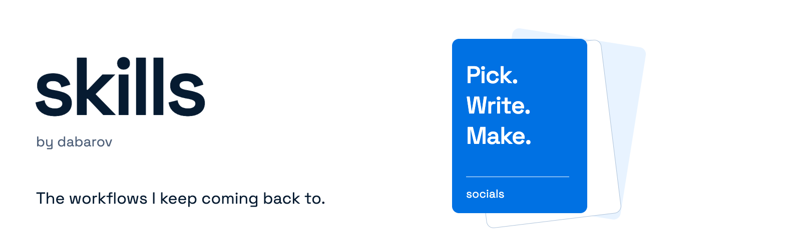
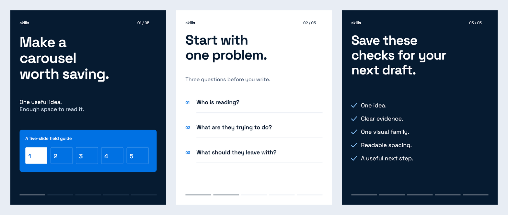

# Skills



I keep the workflows I return to here. Each skill turns a set of decisions, corrections, and working habits into instructions an agent can use again.

The collection covers social carousels and meme Reels, from choosing the idea to checking the finished post.

## Install

```sh
npx skills@latest add dabarov/skills --skill figma-social-carousel
npx skills@latest add dabarov/skills --skill build-meme-reel
```

Figma delivery requires a connected tool that can write to Figma. The skill supplies the workflow; it does not install that connection. See the [provider guidance](skills/socials/figma-social-carousel/references/figma.md).

Meme Reels use FFmpeg, Python, and a small Node dependency for engagement graphics. Supply your approved animated watermark. Image generation needs the agent's image tool. See the [renderer setup](skills/socials/build-meme-reel/references/rendering.md).

The installer lets you choose the agent and installation scope. To see the collection first:

```sh
npx skills@latest add dabarov/skills --list
```

## Socials

| Skill | What it does |
| --- | --- |
| [Figma Social Carousel](skills/socials/figma-social-carousel/SKILL.md) | Research and select an idea, write up to 10 slides, use one visual system, review the result, and deliver it to Figma. |
| [Build Meme Reel](skills/socials/build-meme-reel/SKILL.md) | Cut the joke, add brand and engagement graphics, make face-led covers, and write platform copy. Optional cinema-screen texture keeps the layout intact. |

### Figma Social Carousel

This skill follows the decisions that usually take the most back and forth:

1. Find a topic worth sharing and explain why it fits the audience.
2. Choose the strongest items and write one clear point per slide.
3. Keep the hook, content, pictures, logos, spacing, and final call to action consistent.
4. Inspect the finished slides, fix visible problems, and hand over the source and Figma link.

The publishing limit is **10 slides total**, including the hook and call to action. Cut weaker material before adding slides.

```text
Use $figma-social-carousel to propose three carousel ideas for junior
developers preparing for interviews. Choose the strongest idea, use
one illustration library throughout, and keep the deck within 10 slides
including the hook and final call to action. Put the result in Figma.
```



This is an illustrative layout example. See the [example brief and slide plan](docs/example-carousel.md) for the content behind it.

Open the [full-size cover](docs/example/01-cover.png) or [closing slide](docs/example/05-close.png) to check the type and spacing at publishing size.

### Design defaults

| Setting | Default |
| --- | --- |
| Publishing canvas | 1080 × 1350 px |
| Safe margin | 64 px |
| Gap between slides in Figma | 32 px |

These are documented starting points from the workflow. Adapt them to the brief, brand, and platform.

### What you need

The instructions use the [Agent Skills format](https://agentskills.io/specification). Figma delivery needs a connected tool that can **write to Figma**, plus any setup or skills required by that provider. Installing this folder does not install the Figma connection.

Use native Figma text and components when editable layers are required and the provider supports them. Finished PNG artwork can also be placed in Figma, with an editable source kept separately. Placed PNGs are flattened images; they do not satisfy a request for editable Figma layers.

### Build Meme Reel

A complete Reel package includes the video, compact animated Like → Comment → Follow prompts, four full-size covers, and platform copy. Covers always contain a human face and use blue, black, and white for their graphic treatment. The Instagram caption is one paragraph about the video's actual premise.

```text
Use $build-meme-reel with this clip and the caption "When the paid AI
tokens run out and you switch to the free model." Keep the dialogue
and pause intact. Add the optional cinema-screen texture without
changing the picture size or position. Use our approved watermark,
face-led covers in blue, black, and white, and one topical Instagram
paragraph.
```

The cinema option treats the footage before assembly, so added type, branding, and engagement graphics stay crisp. Perspective, zoom, and handheld drift require a separate request.

The [skill](skills/socials/build-meme-reel/SKILL.md) includes working render helpers and [cover/caption guidance](skills/socials/build-meme-reel/references/covers-and-copy.md). Source footage, faces, and brand marks stay in your own project. The repository supplies the workflow and original engagement artwork.

## Manual install for Codex

Copy the whole skill folder so its references and assets stay together:

```sh
git clone https://github.com/dabarov/skills.git skills-collection
mkdir -p ~/.agents/skills
cp -R skills-collection/skills/socials/figma-social-carousel ~/.agents/skills/figma-social-carousel
cp -R skills-collection/skills/socials/build-meme-reel ~/.agents/skills/build-meme-reel
```

Use this for a first installation. If that destination already exists, update the existing copy deliberately. Codex loads personal skills from `~/.agents/skills`; see the [official guide](https://learn.chatgpt.com/docs/build-skills). If the skill does not appear, restart Codex.

Other agents can use the same skill folder in their supported skill directory.

## Improve a skill

Useful changes come from trying the workflow. Share the prompt, the result, and the correction that helped. [Open an issue](https://github.com/dabarov/skills/issues/new/choose) or read the [contribution guide](CONTRIBUTING.md).

Run the repository checks before sending a change:

```sh
python3 scripts/validate.py
```

[Repository notes](docs/repository-notes.md) explain the packaging and presentation choices.

## License

[MIT](LICENSE) covers the original instructions, code, and artwork in this repository. Third-party logos, illustrations, photos, and brand assets remain subject to their owners' terms. The skill helps source them for a project; they are not bundled here.

Maintained by [dabarov](https://github.com/dabarov).
